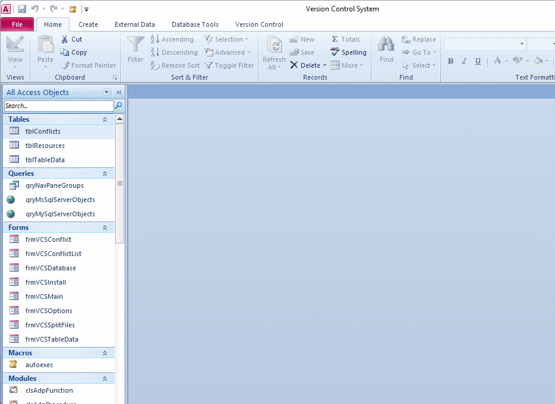

Version Control Add-in (msaccess-vcs-addin)
======================
*for Microsoft Access Database Development*
----------
Supports Microsoft Access 2010, 2013, 2016, 2019, and 365

About
-----

Easily export your Microsoft Access Database objects for use with a version control system like **GitHub** or **GitLab**. (Allows you to track code changes over time, and even collaborate with other developers on the same project.)

This project functions as a **Microsoft Access add-in**, allowing you to use a custom ribbon toolbar to export the objects and source code from the currently open Microsoft Access Database.

Development Focus
-----------------
This project was originally developed to manage the in-house development of numerous Microsoft Access database applications and integrations, some of which are very complex with hundreds of components. The development focus of this particular add-in is primarily in the following areas:
* **Intuitive user interface** for managing code exports and related options, instead of having to set all these options in code or remember commands to run in the immediate window.
* **Ribbon Toolbar** with 64-bit support! Thanks to some fantastic work by Wayne Phillips on the [twinBASIC](https://twinbasic.com/) project, we have a practical *and easy* way to implement a user-friendly ribbon through a light-weight COM Add-in wrapper that passes commands back to the Access add-in.
* **Optimal performance**, even with very complex databases. This is largely achieved through the indexing of database components to export only items that have changed since the last export. Most databases can be exported in a few seconds or less.
* **Extensive support** for different types of database components beyond the standard database objects. See [Supported Objects](wiki/Supported-Objects) for more details on what can be exported from a database.
* **Build From Source** - Using this add-in you can actually build a database entirely from exported source files. This allows collaborative development where changes can be managed at the source code level. See this [this link](wiki/Documentation) for additional details.
* **Code quality** - I am doing my best to continually refine and organize the code into efficient and well commented logical flows. This is a work in progress, but I feel it is critical to the long-term success of the project.
* **ADP Project** support. While this is an outdated technology, there are some of us that still support and maintain complex ADP projects. This tool has been extended to export objects from ADP projects, including server-side SQL object details.

Getting Started
---------
 Simply download the add-in from the [**Releases**](releases) page, and run the file. It will install or update the add-in for you. Additional notes on installation and use can be found on the [project wiki](wiki).

[Quick Start](wiki/Quick-Start) is a simple overview to help you test out this add-in on your project in less than five minutes.

Contributing
------------
Interested in adding a feature or fixing a bug? [Issues](issues) and [pull requests](pulls) are welcome for this project. [This page](/CONTRIBUTING.md) describes some guidelines and the types of contributions would be most helpful.

Development Roadmap
-------------------
In addition to fixing bugs and adding features here and there, here are some of the long-term goals I want to implement in the future:

* Release Version 4 (Early 2024). This version includes a number of substantial updates including an integrated ribbon toolbar interface, support for merging changes into an existing database (instead of having to build entirely from source) and numerous other enhancements.

* Add support for translations in the user interface. After version 4 rolls out, I am hoping to finishing out some functionality to translate the user interface for other languages. While most International developers are at least somewhat familiar with English, I feel like this would make the tool even more comfortable for everyday use.

* Finish an automated testing process where a complex sample database can be exported, reconstructed, exported again, and compared with the original export to ensure that the build process is fully constructing the database from the exported source files.

* Build out an automated deployment workflow using a GitLab runner that is triggered on a commit to automatically build, test, and deploy a database project. Discussion on this idea can be found [here](issues/51).

Project History
----------------
This project was originally forked from [timabell/msaccess-vcs-integration](https://github.com/timabell/msaccess-vcs-integration) in 2015, but has been extensively rewritten over the years. In 2023 the project was detached from the upstream fork and converted to a stand-alone project.
